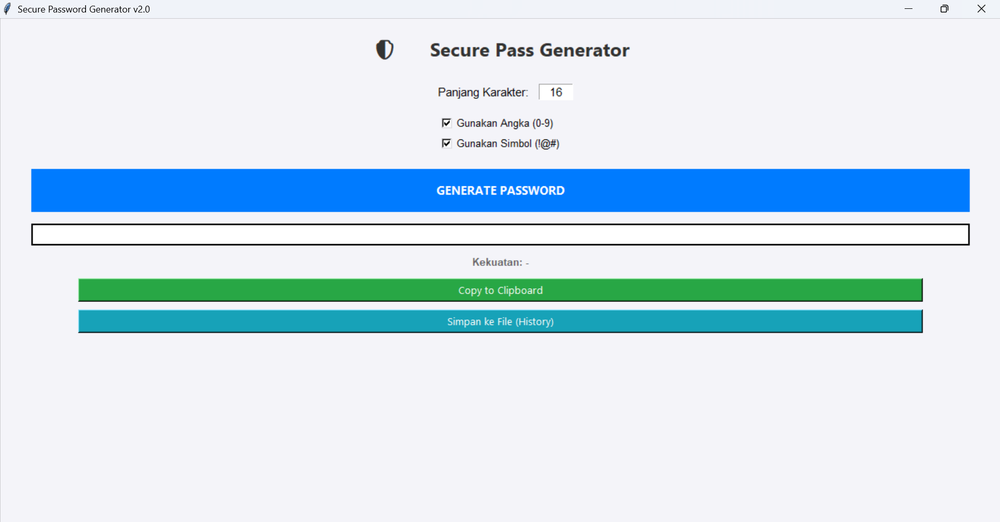

# 🛡️ Secure Password Generator v2.0

Aplikasi desktop sederhana berbasis Python untuk menghasilkan kata sandi (password) yang kuat dan aman. Dibuat menggunakan `tkinter` untuk antarmuka pengguna grafis (GUI).



## ✨ Fitur Utama

- **Generate Password Aman**: Menggunakan modul `secrets` dari Python untuk keamanan kriptografi yang lebih baik.
- **Kustomisasi**: Atur panjang password dan pilih apakah ingin menyertakan angka atau simbol.
- **Indikator Kekuatan**: Menilai kekuatan password (Lemah, Sedang, Kuat) secara visual.
- **Salin Cepat**: Tombol "Copy to Clipboard" untuk menyalin password dengan mudah.
- **Riwayat Penyimpanan**: Simpan password yang dihasilkan ke file teks (`data/password_history.txt`) untuk referensi pribadi.

## 📋 Persyaratan Sistem

- Python 3.x
- Modul `pyperclip` (untuk fitur copy-paste)

## 🚀 Cara Instalasi

1.  **Clone atau Download** repository ini.
2.  Buka terminal atau command prompt di folder project.
3.  Install library yang dibutuhkan:
    ```bash
    pip install -r requirements.txt
    ```
    _(Atau manual: `pip install pyperclip`)_

## 💻 Cara Penggunaan

1.  Jalankan aplikasi dengan perintah:
    ```bash
    python main.py
    ```
2.  **Panjang Karakter**: Masukkan panjang password yang diinginkan (default: 16).
3.  **Opsi**: Centang kotak "Gunakan Angka" atau "Gunakan Simbol" sesuai kebutuhan.
4.  Klik tombol **GENERATE PASSWORD**.
5.  Lihat indikator kekuatan password.
6.  Klik **Copy to Clipboard** untuk menggunakan password, atau **Simpan ke File** untuk menyimpannya ke history loccal.

## 📂 Struktur File

- `main.py`: Kode utama aplikasi (GUI dan logika).
- `requirements.txt`: Daftar library yang dibutuhkan.
- `data/`: Folder otomatis yang dibuat untuk menyimpan file history password.

---

Dibuat dengan ❤️ menggunakan Python.
